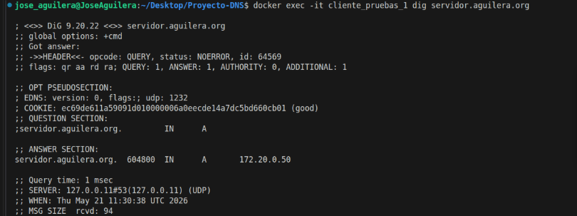

# Práctica: Servidor DNS con BIND9 en Docker

En este repositorio se encuentra la configuración necesaria para levantar un servicio de resolución de nombres mediante contenedores. El dominio local configurado para esta práctica es `aguilera.org`.



## Arquitectura del entorno

El sistema se compone de los siguientes elementos:

* **Servicio principal (dns_master):** Contenedor basado en la imagen oficial de Ubuntu con BIND9 instalado. Tiene asignada de forma fija la dirección `172.20.0.10` para que los demás equipos puedan encontrarlo siempre sin problemas.
* **Equipos cliente:** Dos contenedores con Alpine Linux que incorporan las herramientas de red necesarias para testear que la traducción de dominios a IPs funciona bien.
* **Conexión interna:** Una red aislada con el rango `172.20.0.0/16` exclusiva para que estos elementos se comuniquen entre sí.

Todo el despliegue sigue la filosofía de tratar la infraestructura como si fuera código. Los ficheros donde definimos las zonas DNS no están atrapados dentro del contenedor, sino que los hemos mapeado a la carpeta `config/` de nuestro equipo. Así, podemos modificarlos cómodamente desde Visual Studio Code. Además, he añadido el fichero `.gitignore` para evitar que se suba información sensible o basura a GitHub.

## Instrucciones de uso

Para iniciar todo el sistema, abre la consola en la carpeta del proyecto y lanza:

```bash
docker compose up -d